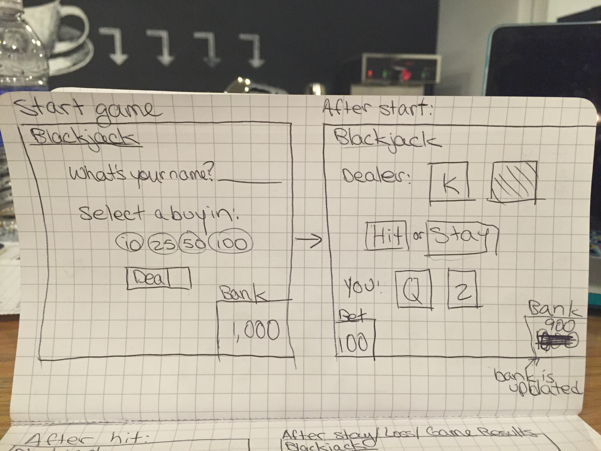
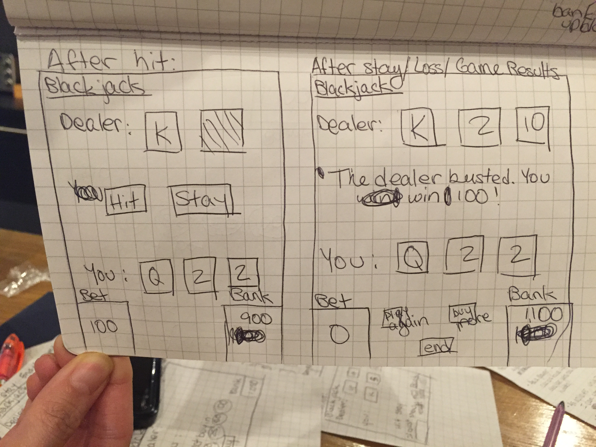
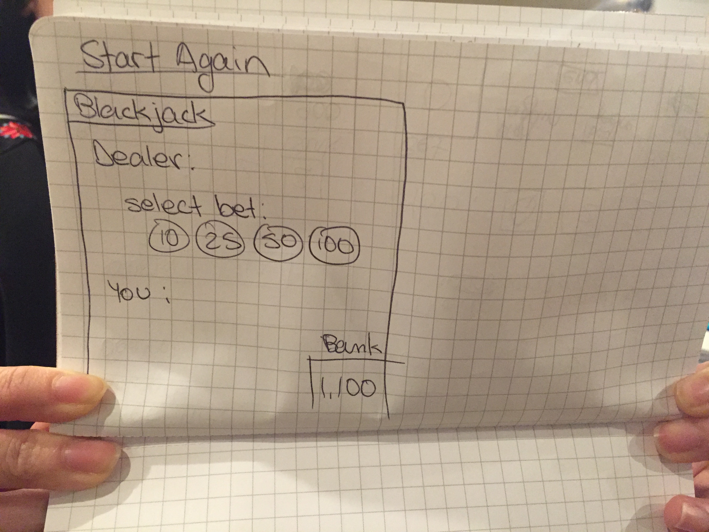

# Blackjack proposal
This will be a website where you can play blackjack against the dealer and accumulate your winnings.

# Blackjack wireframes

# Blackjack user stories

## at the start of the game
- as a player I start off with 1000 in the bank
- player can enter name
- as a player I can start a game
- as a player when I start the game, I have to select one of 4 bets: 10, 25, 50, 100

## at the initial game outset
- bet amount is subtracted from the bank and added to the bet
- the deck is shuffled and generated in a new array
- the dealer and player are each dealt 2 cards out of a deck of 52 cards
- the player's 2 cards are dealt face up, while the dealer is dealt the first card up, the second card down
- if either the dealer or player has 21 after the first play, the game ends and shows results

## during game play
- the player goes first
- the player can choose to hit or stay
- when the player hits, they are dealt a new card from the deck
  - if the result of the hit doesn't end the game, the player can continue to choose to hit or stay again
  - if the player makes 21 or higher the game ends and the results show
- when the player stays, the dealer's turn is computed
  - must hit on 16 and under
  - must stay on 17 and higher
- after a winner is determined, the game ends

## game results
- the dealer cards are shown
- text is generated to tell the outcome
- bet amount is removed
- bank is adjusted or not based on the outcome
- options are available to start over, buy more money (if i get to it), or end game

## start over
- all cards are removed from the table
- deck is reshuffled
- player can start a new game
- player must select a bet to play
